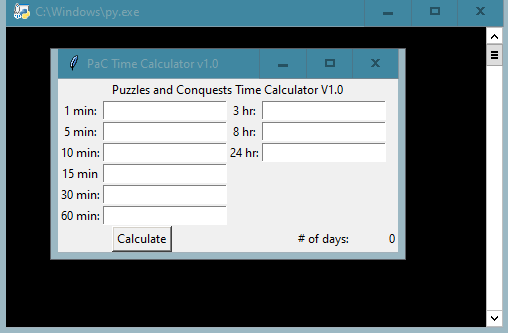

# PAC Time Calculator
A graphical calculator for a mobile game called "Puzzles and Conquests".

## Why
Because I'm a nerd and you should be, too.

# Status
Version 1.02

# Demo


# Built With
Python
TKinter

# Code Peek
```
while index != len(entry_gets):
    total_time += int(list(entry_gets.values())[index])
    index += 1
```

# Usage
With Python and TKinter installed, copy PAC.py onto your machine and run with your desired virtural environment. A new window should pop up along with a background shell. Enter the number of speed-ups held accordingingly and click "calculate".

# Contribute
This doesn't have to be just a calculator, could be more.

# Credits
Credits to all the developers that made this happen in the first place

# License
MIT @ Nicholas Crook
